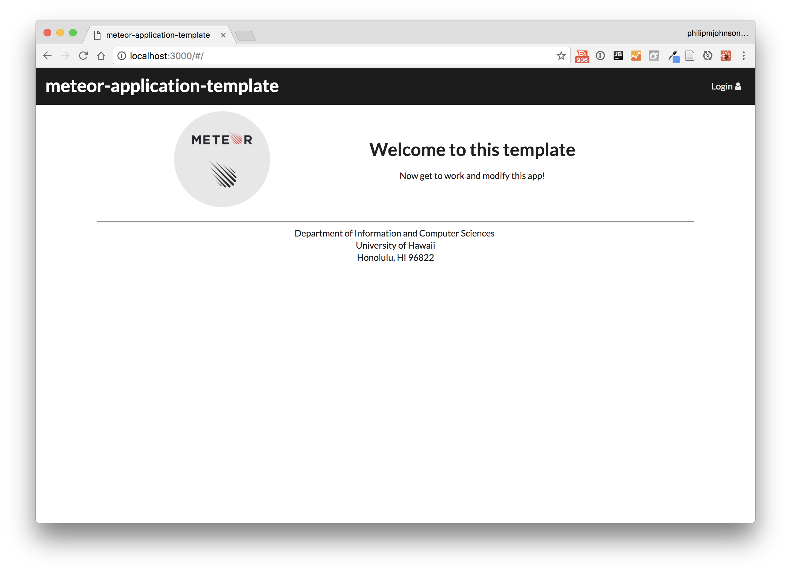
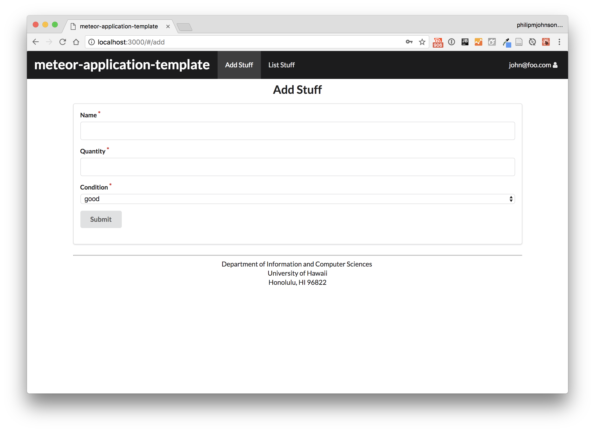
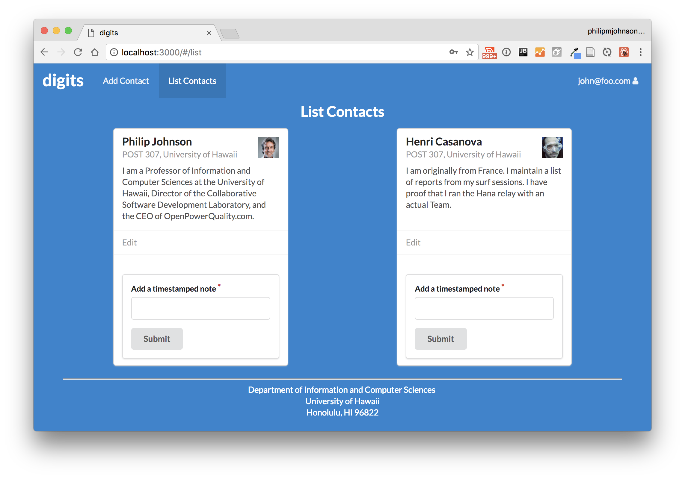

## Table of Contents

* [Overview](#overview)

## Overview
Books for Bows is a web application that provides a market place for students to buy and sell textbooks directly to other students. It is built with the technology stack that consists of:

* [Meteor](https://www.meteor.com/) for Javascript-based implementation of client and server code.
* [React](https://reactjs.org/) for component-based UI implementation and routing.
* [Semantic UI React](https://react.semantic-ui.com/) CSS Framework for UI design.
* [Uniforms](https://uniforms.tools/) for React and Semantic UI-based form design and display.

Components of the web application:

* There are three primary collections (Users and Books, Classes)
* Three main pages (Marketplace, Profile, Search) that uses the prior data collections and allows users to manipulate and filter through those collections.
* Code that fills the database with default data for Users, Books, and Classes. To demonstrate usage of the marketplace.
* A page to filter through different Classes and Books to query the collections to obtain a specific book.

## Pages
As a basis for the site, here are some of the pages that we want to include from the <a href="https://ics-software-engineering.github.io/meteor-application-template-react/">meteor-react template</a> as well as the <a href="https://ics-software-engineering.github.io/digits/">Digits</a> assignment:

First of all, we want to include a landing page for our site. We would want it to include the title of our site as well as our purpose/mission. 

Since we only want our site to be accessed by UH students, we would need some sort of way to only have UH students be able to access the information on the site. We could enforce this by restricting access to only the people who have logged in to our site. 

We would need to verify that new users are UH students when they register. 

Users will be able to input information about the book they are trying to sell. They would need to include a picture of the book, as well as the ISBN, title, and cost. 

Users can browse the books people are selling. We would probably want to display it using cards, such as in the digits assignment. This way we could promenently display the images associated with the book, as well as list key information in an interesting way. 

