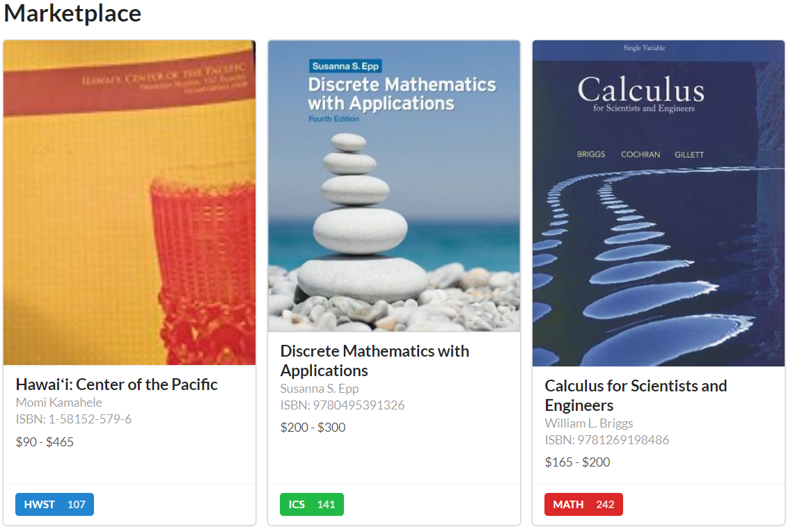
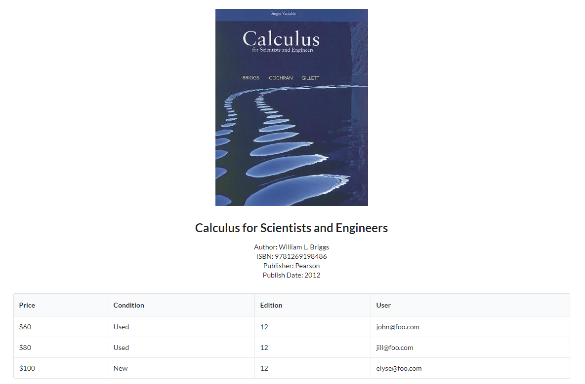

## Table of Contents

* [Overview](#overview)
* [Pages](#pages)

## Overview
Books for Bows is a web application that provides a market place for students to buy and sell textbooks directly to other students. It is built with the technology stack that consists of:

* [Meteor](https://www.meteor.com/) for Javascript-based implementation of client and server code.
* [React](https://reactjs.org/) for component-based UI implementation and routing.
* [Semantic UI React](https://react.semantic-ui.com/) CSS Framework for UI design.
* [Uniforms](https://uniforms.tools/) for React and Semantic UI-based form design and display.

Components of the web application:

* There are four primary collections (Users, Books, Classes, Listings)
* Three main pages (Marketplace, Profile, Search) that uses the prior data collections and allows users to manipulate and filter through those collections.
* Code that fills the database with default data for Users, Books, and Classes. To demonstrate usage of the marketplace.
* A page to filter through different Classes and Books to query the collections to obtain a specific book.

## Pages
This section provides information and sample mockups of the app's pages.

### Landing page
The landing page is presented to users upon first visiting the site.

### Login

### Register

### Marketplace
Users will be able to see information about available textbook listings. Users don't need to be logged in to see this. If multiple users are selling the same book, only one card is shown. The card will display:
- Image of cover
- Title
- Author
- Price (or price range if there are multiple sellers)
- Course alphas that use the book

### Shelf
When a user clicks on a card from the marketplace, they can see all the available listings of the associated textbook, as well as additional information supplied by the seller such as condition or any pictures.

### Create Listing
Logged in users can create listings that will be displayed on the marketplace.
<image src="assets/images/mockups/createlisting-mockup.png" style="border: 1px solid black">

## Books For Bows' Current Layout

### Galaxy Deployed Landing Page
Here we have the first page to greet the user upon visiting the site. Click on the image to view this page
[<image src="assets/images/mockups/createlisting-mockup.png">](https://www.wikihow.com/Make-a-Smoothie-Bowl)

## Useful Links:

* [Books For Bows GitHub Organization](https://github.com/books-for-bows)
* [Books For Bows Deployed on Galaxy]()
* [Milestone 1](https://github.com/books-for-bows/books-for-bows/projects/2)
* [Milestone 2]()