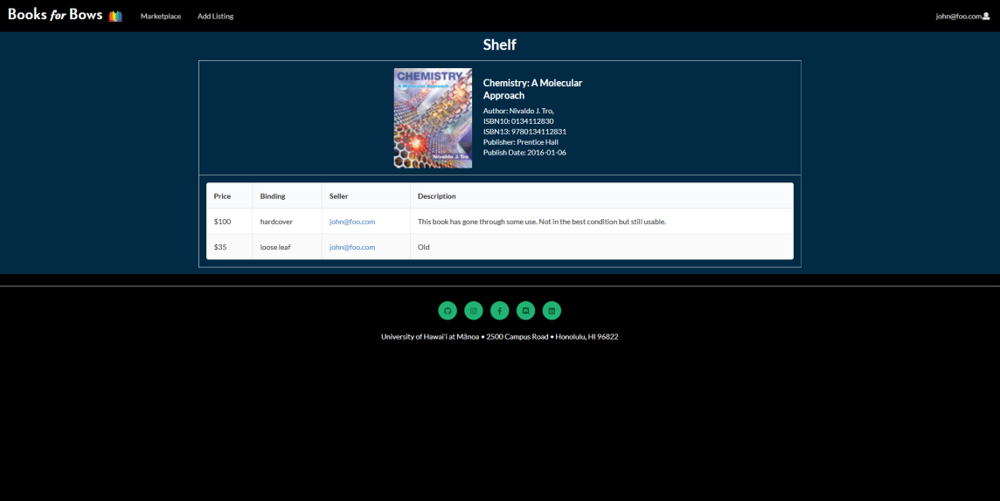
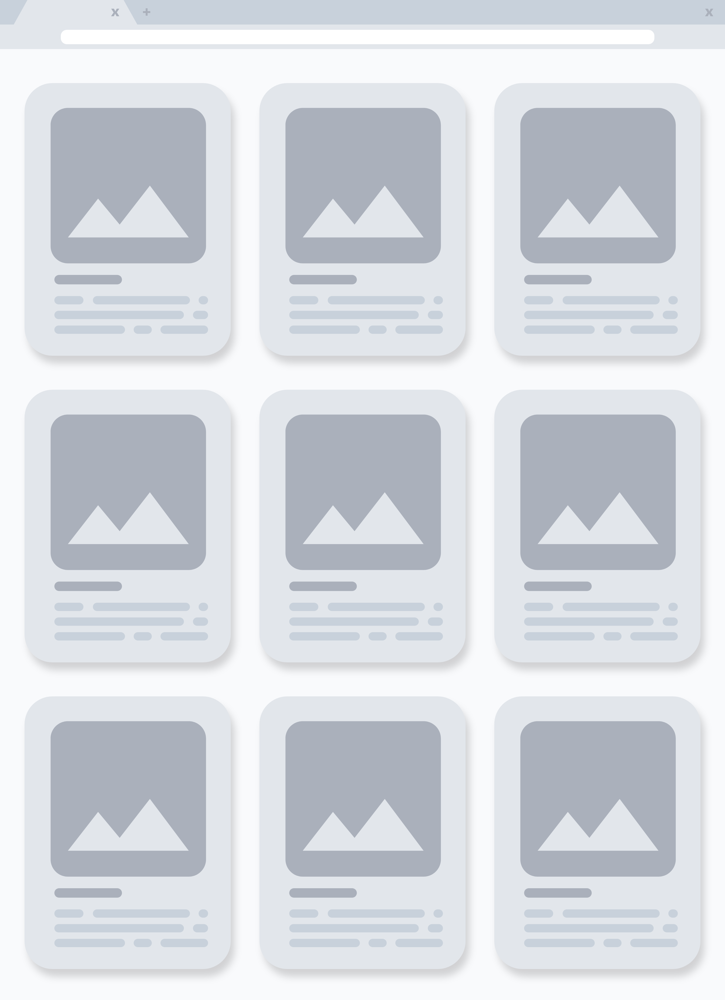

## Table of Contents

* [Overview](#overview)
* [Useful Links](#useful-links)
* [User Guide](#user-guide)
* [Community Feedback](#community-feedback)
* [Developer Guide](#developer-guide)
* [Development History](#development-history)

## Overview


[Books for Bows](http://books-for-bows.meteorapp.com/#/) is a marketplace for University of Hawai’i students to buy textbooks from and sell textbooks directly to fellow students. 

We decided to create this project because shopping for textbooks can be confusing, difficult, and frustrating:
* The campus bookstore is expensive and wasteful; you don't NEED a brand new book if you are going to use it for one semester. 
* It's hard to filter for only UH textbooks on Craigslist, and you have to sort through all the textbooks listed.
* Sometimes it can be hard to tell if you have the right book and you may accidentally buy the international version. 
* Even if you find a cheaper book online, shipping is a real hassle. The cost to ship can bring the overall price of the textbook to the original price anyway, not to mention that it could take a month of the book to actually arrive on island. 

## Useful Links

* [Books For Bows GitHub Organization](https://github.com/books-for-bows)
* [Books For Bows Deployed on Galaxy](http://books-for-bows.meteorapp.com/#/)
* [Milestone 1](https://github.com/books-for-bows/books-for-bows/projects/2)
* [Milestone 2](https://github.com/books-for-bows/books-for-bows/projects/3)
* [Milestone 3](https://github.com/books-for-bows/books-for-bows/projects/4)

## User Guide
### Landing page
Welcome to the Books for Bows website! This landing page will greet you upon arrival to our site.


The landing page includes some features about our website such as the amount of listings available. 


### Login or Register
You can click on the login link in the top right corner of the page login or make an account. Accounts will provide you with access to additional pages and features, such as browsing available listings and creating or editing listings.

### Marketplace
Anyone can come to the marketplace to see all the textbooks available for purchase. Each book card acts like a folder which contains the listings for the textbook it represents. As long as there is at least one listing for a textbook, a book card will appear in the marketplace. 

The card displays:
* Image of cover (or a default image if there is no cover available)
* Title
* Author
* ISBN
* Course alphas that use the textbook 
* A link to the all the listings of the textbook 


### Shelf
When you click on the "View Listings" link on a book card in the marketplace, you will be taken to a new page. Here, logged in users are able to view all the available listings of the associated textbook, as well as additional information supplied by the seller such as condition of the book. 



### Create Listing
Logged in users can create listings that will be displayed on the marketplace.


### Edit Listing
Logged in users can edit their previously made listings. 


## Community Feedback 

As of Dec 17, 2019, a general consensus of the feedback for our website: 
### Pros:
* Minimalistic design 
* Ability to preview book cover 
* Easily see which textbooks are needed for specific courses
* Easy to use and navigate 

### Cons:
* Lengthy landing page -> shorter landing page; put the different sections into a smaller grid
* UH courses only; some students take classes on multiple campuses -> accomodate multiple campuses
* Loading sometimes takes a while -> sorry about that
* No way to contact seller rather than just through emails -> chatroom 

We appreciate the feedback and will take it into consideration for future Books for Bows updates. 


## Developer Guide 

It is built with the technology stack that consists of:

* [Meteor](https://www.meteor.com/) for Javascript-based implementation of client and server code.
* [React](https://reactjs.org/) for component-based UI implementation and routing.
* [Semantic UI React](https://react.semantic-ui.com/) CSS Framework for UI design.
* [Uniforms](https://uniforms.tools/) for React and Semantic UI-based form design and display.

### Installation
1. [Install Meteor](https://www.meteor.com/install)
2. Visit the Github [repository](https://github.com/books-for-bows/books-for-bows) and clone the repository to your computer.
3. Change directory to where you download the repository and into the app directory and run the command:

```
$ meteor npm install
```

4. To run the app without a Google Books API key (limited requests) use this command:

```
$ meteor npm run start
```

If everything works, the application will show up on [http://localhost:3000](http://localhost:3000).

If you would like to be able to have more requests, you can sign up for a [Google Books API key](https://developers.google.com/books/).

Then creat a copy of settings.development.json in the app/config directory and name the file settings.production.json and at the top of the file add:

```json
"public": {
    "api_key": "YOUR_API_KEY_HERE"
},
```

And to run the app with the API key use this command:

```
$ meteor npm run start-prod
```

Like before, the application should show on [http://localhost:3000](http://localhost:3000).

## Development History 
### [Milestone 1](https://github.com/books-for-bows/books-for-bows/projects/2) - Prototypes and Mockups 
(Nov 9 2019 – Nov 21 2019) 

{:height="25%" width="25%"}

### [Milestone 2](https://github.com/books-for-bows/books-for-bows/projects/3) - First Look and Limited Functionality
(Nov 22 2019 – Dec 4 2019) 

{:height="40%" width="40%"}
{:height="50%" width="50%"}

### [Milestone 3](https://github.com/books-for-bows/books-for-bows/projects/4) - Improved Functionality and Redesign
(Dec 5 2019 – Dec 17 2019) 

{:height="50%" width="50%"}

### Milestone 4 – Moving Forward 
In the future we hope to implement improved functionality and features, based on the feedback we received in Milestone 3. 

